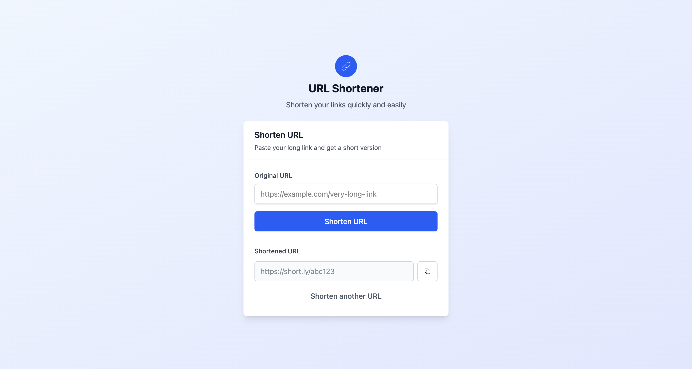

# URL Shortener



## Project Description

This project is a web application that allows users to shorten long URLs into compact, easy-to-share links. The system stores the mapping between the original and shortened URLs in a database and automatically redirects users to the original URL when they access the short link.

## Goal

The main goal is to provide a simple and efficient tool for shortening URLs, making them more manageable for sharing on social media, messaging platforms, and other contexts where long links are inconvenient. The project also serves as an educational example of building a modern web application with robust validation and persistent storage.

## Technologies Used

- **Go (Golang):** Main programming language for the backend.
- **Gin:** Web framework for routing and HTTP controller management.
- **GORM:** ORM for database management using SQLite.
- **SQLite:** Lightweight embedded database for storing URLs.
- **HTML + Tailwind CSS:** For a modern, responsive user interface.
- **HTMX:** Enhances user experience with dynamic interactions without full page reloads.
- **SHA-256:** Hashing algorithm used to generate unique short codes from original URLs.

## Project Structure

- `/app`: Business logic, models, controllers, and routes.
- `/templates`: HTML files for the user interface.
- `main.go`: Application entry point.
- `go.mod` and `go.sum`: Dependency management files.

## Getting Started

### Clone the repository

```bash
git clone git@github.com:HectorZR/url-shortener.git
cd url-shortener
```

### Install dependencies

Make sure you have [Go](https://go.dev/dl/) installed (version 1.24 or higher recommended).

```bash
go mod download
```

### Start the project

```bash
air
```

The server will start on [http://localhost:8000](http://localhost:8000).

---

## Improvement Opportunities

- **User management and authentication:** Allow registered users to manage their own links.
- **Usage statistics:** Display how many times each short URL has been accessed.
- **Link expiration:** Enable short links to expire after a certain time or number of uses.
- **Custom short codes:** Allow users to choose their own short code.
- **Support for other databases:** Facilitate migration to systems like PostgreSQL or MySQL for production environments.
- **Advanced collision handling:** Implement more sophisticated strategies to avoid short code collisions.
- **Cloud deployment:** Automate deployment to platforms like Heroku, AWS, or GCP.
- **Internationalization:** Support multiple languages in the user interface.

---

This project is an excellent starting point for learning about web development in Go, database integration, and best practices for validation and security in web applications.
